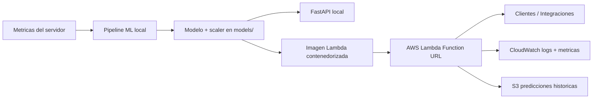

# MLOps Pipeline - Server Failure Prediction

Proyecto de MLOps para entrenar, evaluar y servir un modelo de clasificacion que predice fallas de servidor a partir de metricas operativas.

## Estado actual del proyecto

- Arquitectura final basada en entornos virtuales (`venv`) para desarrollo local.
- Serving en dos modos:
  - API REST local con FastAPI.
  - Inferencia productiva en AWS Lambda (contenedor) expuesta por Function URL.
- SageMaker **no forma parte del flujo activo de ejecucion**.
  - Hay dependencias heredadas en `requirements` por compatibilidad/historico, pero el flujo actual no depende de SageMaker para entrenar ni servir.

## Function URL desplegada

Endpoint publico actual de Lambda Function URL:

`https://6knpvdrrmvtajeo4cqp7ipifi40ynohs.lambda-url.us-east-1.on.aws/`

## Objetivo funcional

A partir de metricas operativas del servidor, el sistema estima:

- Si habra fallo (`will_fail`)
- Probabilidad de fallo (`probability`)
- Nivel de riesgo (`risk_level`)
- Tiempo estimado a fallo (solo en API FastAPI)
- Causas probables (solo en API FastAPI)

## Arquitectura (final)



## Estructura del repositorio

```text
api/                    # App FastAPI, esquemas y routers
src/                    # Generacion de datos, preprocess, train, evaluate, predict
lambda_folder/          # Handler Lambda + Dockerfile de inferencia
monitoring/             # Setup de alarmas/dashboard CloudWatch
data/                   # Dataset raw y procesado
models/                 # Artefactos del modelo (local)
reports/                # Metricas y reportes
scripts/                # Monitoreo de calidad
tests/                  # Tests unitarios e integracion
.github/workflows/      # CI, entrenamiento, CD y monitor programado
```

## Stack tecnico

- Python 3.13 (definido en `.python-version`)
- FastAPI + Uvicorn
- scikit-learn + XGBoost
- MLflow (tracking de experimentos)
- pandas + numpy + joblib
- Docker / Docker Compose
- AWS Lambda (contenedor), ECR, S3, CloudWatch
- Pytest

## Requisitos previos

- Python 3.13 recomendado
- `pip`
- Docker Desktop (opcional para containers)
- AWS CLI configurado (solo para despliegue/monitoring)

## Instalacion local (venv)

### Windows PowerShell

```powershell
python -m venv .venv
.\.venv\Scripts\Activate.ps1
pip install --upgrade pip
pip install -r requirements.txt
```

### Linux/macOS

```bash
python -m venv .venv
source .venv/bin/activate
pip install --upgrade pip
pip install -r requirements.txt
```

## Pipeline ML (entrenamiento y evaluacion)

Ejecutar desde la raiz del repo:

```bash
python src/generate_data.py
python src/preprocess.py
python src/train.py
python src/evaluate.py
```

Artefactos principales:

- Dataset raw: `data/raw/server_metrics.csv`
- Splits procesados: `data/processed/*.csv`
- Modelo/scaler: `models/model.pkl`, `models/scaler.pkl`
- Modelo JSON XGBoost: `models/model.json`
- Metricas y graficas: `reports/metrics.json`, `reports/*.png`
- Runs de MLflow: `mlruns/`

## MLflow

El entrenamiento registra automaticamente parametros, metricas y artefactos.

```bash
mlflow ui
```

UI local: `http://localhost:5000`

## Servir el modelo

## Opcion A - FastAPI local

```bash
uvicorn api.main:app --host 0.0.0.0 --port 8000 --reload
```

Documentacion: `http://localhost:8000/docs`

Endpoints:

- `GET /health`
- `GET /metrics`
- `POST /predict`

## Opcion B - Docker Compose (FastAPI)

```bash
docker compose up --build
```

## Opcion C - AWS Lambda Function URL (produccion)

Function URL:

`https://6knpvdrrmvtajeo4cqp7ipifi40ynohs.lambda-url.us-east-1.on.aws/`

Ejemplo de invocacion:

```bash
curl -X POST "https://6knpvdrrmvtajeo4cqp7ipifi40ynohs.lambda-url.us-east-1.on.aws/" \
  -H "Content-Type: application/json" \
  -d '{
    "cpu_usage": 87.5,
    "ram_usage": 91.2,
    "disk_io": 78.4,
    "network_traffic": 520.0,
    "temperature": 83.0,
    "cpu_spike_count": 14,
    "ram_spike_count": 11,
    "uptime_hours": 1500.0
  }'
```

Respuesta esperada (Lambda):

```json
{
  "will_fail": true,
  "probability": 0.8421,
  "risk_level": "CRITICAL"
}
```

Nota: FastAPI (`/predict`) devuelve campos adicionales (`time_to_failure`, `top_causes`, `model_version`) que no forman parte de la respuesta minima de Lambda actual.

## Contrato de entrada

Campos esperados para prediccion:

- `cpu_usage` (float, 0-100)
- `ram_usage` (float, 0-100)
- `disk_io` (float, 0-100)
- `network_traffic` (float, >= 0)
- `temperature` (float, 0-150)
- `cpu_spike_count` (int, >= 0)
- `ram_spike_count` (int, >= 0)
- `uptime_hours` (float, >= 0)

## Pruebas

Correr suite completa:

```bash
pytest tests/ -v
```

Cobertura opcional:

```bash
pytest tests/ --cov=api --cov=src --cov=lambda_folder -v
```

Invocar handler Lambda en local:

```bash
python invoke_lambda_local.py
```

## CI/CD (GitHub Actions)

- `ci.yml`: tests en `push` y `pull_request` a `main`.
- `train.yml`: pipeline de entrenamiento, evaluacion y validacion de threshold (`F1 >= 0.85`).
- `cd.yml`: build/push de imagen a ECR y actualizacion de Lambda.
- `monitor.yml`: monitor programado de calidad de predicciones.

## Monitoreo

- Metricas custom en CloudWatch namespace `MLOps/ServerFailure`.
- Logs estructurados JSON desde Lambda.
- Persistencia opcional de predicciones en S3.
- Setup de alarmas/dashboard: `python monitoring/setup_cloudwatch.py`

Ver detalle en `monitoring/README.md`.

## Variables de entorno relevantes

Solo nombres (sin valores):

- `MODELS_S3_BUCKET`
- `MODEL_S3_KEY`
- `SCALER_S3_KEY`
- `PREDICTIONS_S3_BUCKET`
- `PREDICTIONS_S3_PREFIX`
- `MODEL_VERSION`
- `FORCE_CLOUDWATCH`

## Seguridad y buenas practicas

- No subir secretos ni credenciales (`AWS_ACCESS_KEY_ID`, `AWS_SECRET_ACCESS_KEY`, tokens).
- No versionar datos sensibles ni artefactos pesados (`models/*.pkl`, datasets privados, `mlruns/` con info sensible).
- Usar GitHub Secrets para CI/CD.
- Revisar logs antes de compartirlos para evitar fuga de informacion operativa.
- Rotar credenciales si alguna vez fueron expuestas accidentalmente.
- Limitar permisos IAM al minimo necesario (principio de menor privilegio).

## Limites conocidos

- El `requirements.txt` incluye paquetes historicos (incluyendo SageMaker) que no son obligatorios para el flujo principal local + Lambda.
- Hay diferencias de contrato de salida entre FastAPI y Lambda (intencional por simplicidad en Lambda).

## Licencia

Este proyecto se distribuye bajo la licencia incluida en `LICENSE`.
